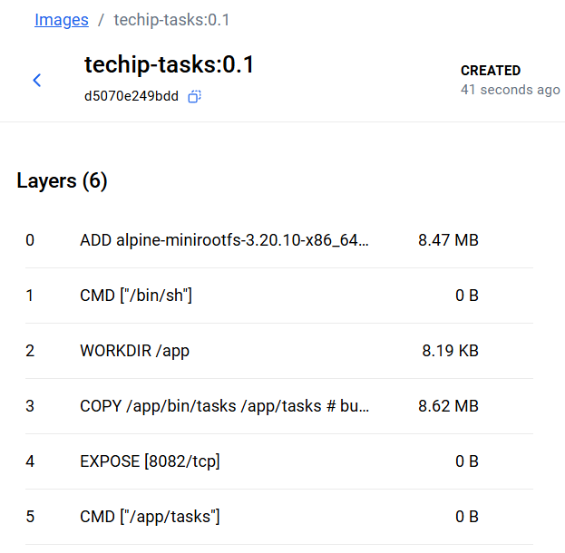
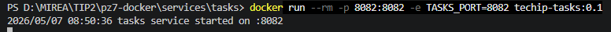
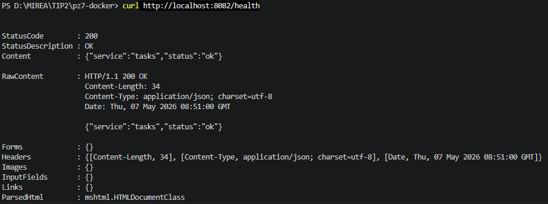
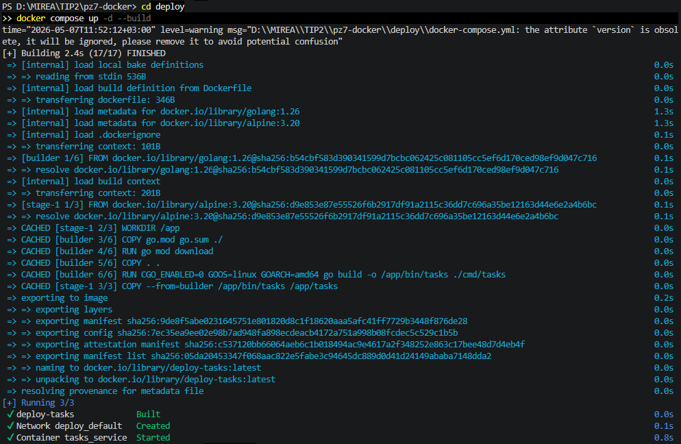
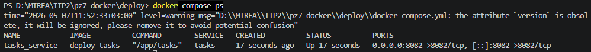
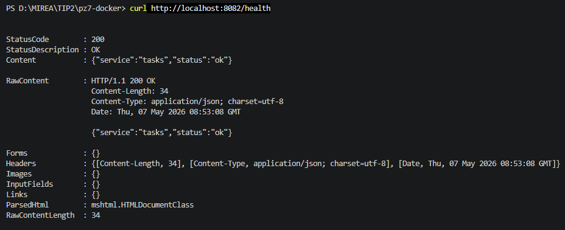

# Практическое занятие №7
# Написание Dockerfile и сборка контейнера

**Дисциплина:** Технологии индустриального программирования  
**Семестр:** 2, 2025-2026  
**Студент:** Синицын А.Г. ЭФМО-01-25

---

## Краткое описание проекта

Реализована контейнеризация учебного Go-сервиса `tasks`.  
Сервис предоставляет маршрут `GET /health` и возвращает JSON с текущим статусом и названием сервиса.  
Порт сервиса задаётся через переменную окружения `TASKS_PORT` (по умолчанию 8082).

В проекте:
- Написан минимальный HTTP-сервер на Go.
- Настроены `.dockerignore` и многоэтапный `Dockerfile` (multi-stage build).
- Собран Docker-образ, запущен контейнер с пробросом порта и переменной окружения.
- Подготовлен `docker-compose.yml` для удобного локального запуска.

---

## Структура проекта
```
pz7-docker/
├── services/
│   └── tasks/
│       ├── cmd/
│       │   └── tasks/
│       │       └── main.go
│       ├── go.mod
│       ├── go.sum
│       ├── Dockerfile
│       └── .dockerignore
└── deploy/
    └── docker-compose.yml
```

---

## Требования к проекту

- Установленный Docker 
- Go 1.21+
- Свободный порт 8082

---

## Результаты выполнения (скриншоты)

### Сборка образа


### Запуск контейнера (docker run)


### Проверка маршрута /health


### Docker Compose up -d


### Статус контейнеров через docker compose ps


### Проверка маршрута /health через Compose


---

## Ответы на контрольные вопросы

**1. Чем Docker-образ отличается от контейнера?**  
Образ — это шаблон, по которому создаётся контейнер. Он содержит базовую систему, файлы и инструкции запуска. Контейнер — это уже запущенный экземпляр образа, изолированный процесс.

**2. Зачем нужен Dockerfile?**  
Dockerfile — это текстовое описание того, как должен собираться образ. В нём перечислены базовый образ, копируемые файлы, выполняемые команды и точка входа.

**3. Что такое multi-stage build?**  
Multi-stage build — сборка образа в несколько этапов (стадий). На первом этапе обычно происходит компиляция, на втором — формируется финальный образ только с необходимыми артефактами, без инструментов сборки.

**4. Почему для Go-сервисов удобно использовать multi-stage build?**  
Go компилируется в один исполняемый файл. Можно на первой стадии собрать бинарник, а на второй использовать минимальный образ (например, Alpine), куда копируется только этот бинарник. Итоговый образ получается лёгким, без компилятора и лишних зависимостей.

**5. Зачем нужен .dockerignore?**  
Чтобы исключить из контекста сборки ненужные файлы (.git, логи, временные файлы, локальные конфигурации). Это уменьшает размер контекста и ускоряет сборку.

**6. Для чего используются переменные окружения в контейнере?**  
Для передачи конфигурации приложению без пересборки образа. Приложение читает os.Getenv и подстраивает поведение (порт, DSN, уровни логирования и т.д.).

**7. Что делает флаг -p при запуске контейнера?**  
Пробрасывает порт с хоста в контейнер. Формат -p 8082:8082 означает, что порт 8082 на хостовой машине перенаправляется на порт 8082 внутри контейнера.

**8. Для чего нужен Docker Compose?**  
Docker Compose позволяет описать и запустить многоконтейнерное приложение одной командой. В YAML-файле задаются сервисы, порты, переменные окружения, тома и сетевые настройки.

**9. Почему контейнеризация упрощает деплой?**  
Потому что окружение приложения фиксируется в образе. Не нужно вручную настраивать Go-версию, зависимости и пути на каждом сервере. Достаточно запустить контейнер из образа, и поведение будет одинаковым на любой машине.

**10. Почему не стоит вшивать конфигурацию и секреты прямо в образ?**  
Образ может быть опубликован или использован в разных средах. Если пароли или ключи жёстко закодированы, их трудно сменить, они попадают в историю слоёв и становятся доступны всем, у кого есть образ. Правильнее передавать их через переменные окружения или внешние системы секретов.
